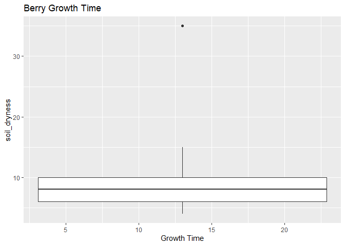
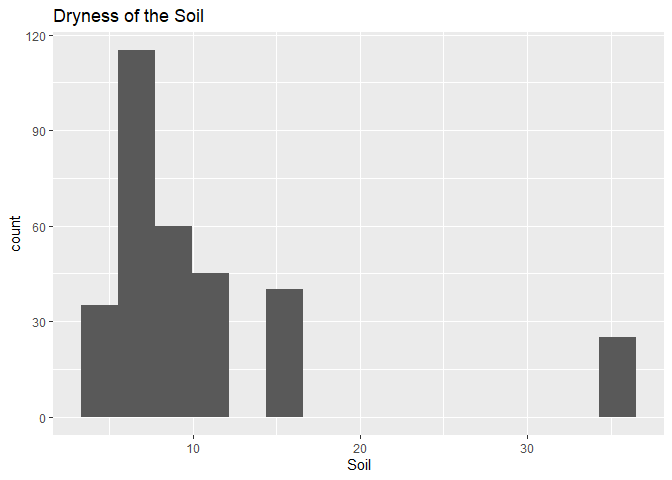
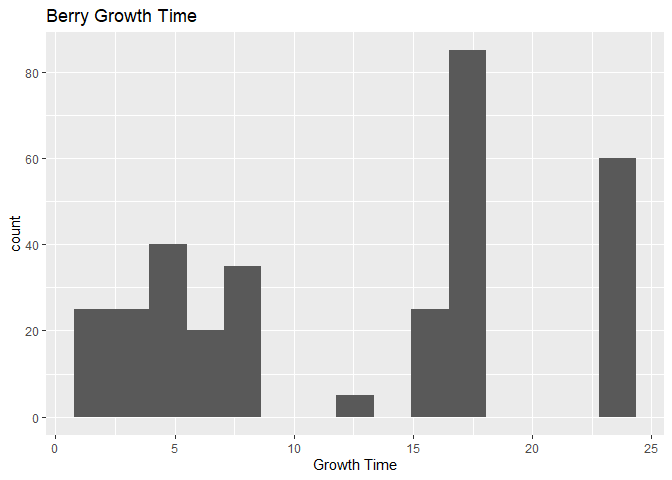
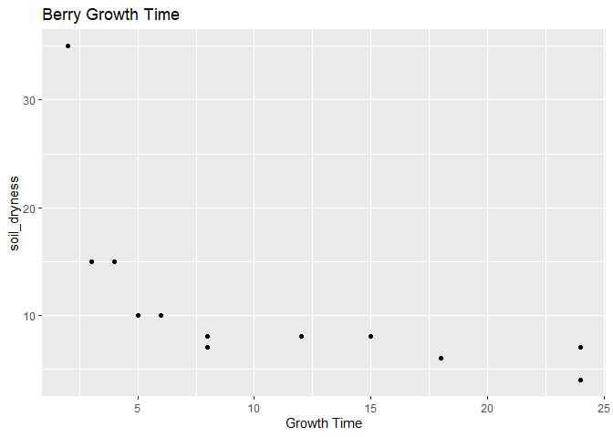

ST 558 - Project 2
================
Paula Bailey and Yi Ren
2022-09-22

Pokémon inhabit the world of the Pokémon games. The franchise was
created by Satoshi Tajiri in 1996. These fictional creatures can be
caught using Pokéballs and trained by battling with other Pokémon. There
are current 920 species according to Wikipedia.

This vignette will walk the reader through the process of connecting to
& collecting data from PokeAPI <https://pokeapi.co/> within R
programming environment.

## Reference to Render Code

``` r
rmarkdown::render("Project2.Rmd", "github_document","README.md")
```

## Packages for Vignette

The following packages are required for connecting and retrieving data
from the API.

1.  `httr` - *Retrieves Data from an API*
2.  `jsonlite` - *Parses Results from an API Query*
3.  `dplyr` - *A part of the `tidyverse` used for manipulating data*
4.  `tidyr` - *A part of the `tidyverse` used for data cleaning and
    ‘tidying’*
5.  `ggplot2` - *A part of the `tidyverse` used for creating graphics*

``` r
# Read in Required Packages 
library(httr)
library(jsonlite)
library(tidyverse)
library(ggplot2)
```

The pokemon api allow the user to pull information via the pokemon’s
name or ID number.

``` r
#reading encounter data
encounter_api = GET("https://pokeapi.co/api/v2/pokemon/ditto/encounters") 
encounter_text<-content(encounter_api,"text")
encounter_json<-fromJSON(encounter_text,flatten=TRUE)
```

``` r
#where you can encounter this pokeman
encounter_json$location_area.name
```

    ##  [1] "sinnoh-route-218-area"          "johto-route-34-area"           
    ##  [3] "johto-route-35-area"            "johto-route-47-area"           
    ##  [5] "kanto-route-13-area"            "kanto-route-14-area"           
    ##  [7] "kanto-route-15-area"            "cerulean-cave-1f"              
    ##  [9] "cerulean-cave-2f"               "cerulean-cave-b1f"             
    ## [11] "kanto-route-23-area"            "pokemon-mansion-b1f"           
    ## [13] "desert-underpass-area"          "giant-chasm-forest"            
    ## [15] "giant-chasm-forest-cave"        "pokemon-village-area"          
    ## [17] "johto-safari-zone-zone-wetland"

using above to create function: get_encounter \<- function()

``` r
#reading forms data
forms_api = GET("https://pokeapi.co/api/v2/pokemon-form/ditto/") 
api_forms<-content(forms_api,"text")
api_json2<-fromJSON(api_forms,flatten=TRUE)
```

``` r
#reading types data
types_api<-GET(api_json2[["types"]][["type.url"]][[1]])
types_text<-content(types_api,"text")
df_types<-fromJSON(types_text,flatten=TRUE)
```

``` r
#obtain moves and damage info about Pokémon
#df_types[["moves"]]['name']
df_types[["move_damage_class"]]['name']
```

    ## $name
    ## [1] "physical"

``` r
df_types[["damage_relations"]][["double_damage_from"]]['name']
```

    ##       name
    ## 1 fighting

``` r
df_types[["damage_relations"]][["half_damage_to"]]['name']
```

    ##    name
    ## 1  rock
    ## 2 steel

``` r
df_types[["damage_relations"]][["no_damage_from"]]['name']
```

    ##    name
    ## 1 ghost

``` r
df_types[["damage_relations"]][["no_damage_to"]]['name']
```

    ##    name
    ## 1 ghost

``` r
#df_types[["move_damage_class"]]
```

This next section will pull information about the pokemon berry from the
api. Berries are small fruits that can provide restoration, stat
enhancement, and even damage negation when eaten by Pokémon.
<https://bulbapedia.bulbagarden.net/wiki/Berry> information seems to be
the only information that is worth plotting.

Gets data for the first berry and puts it into a df

``` r
res = GET("https://pokeapi.co/api/v2/berry/1/") 
api_text<-content(res,"text")
api_json<-fromJSON(api_text,flatten=TRUE)
```

``` r
get_berries_df <- as.data.frame(api_json)
```

Gets data for the remaining berries and combines into first berry df.

``` r
for(i in 2:64){
  #increment through each berry until we get all 64 berries
  base <- "https://pokeapi.co/api/v2/berry/"
  call_next <- (paste0(base,i,"/"))
  
  res2 = GET(call_next) 
  api_text2<-content(res2,"text")
  api_json2<-fromJSON(api_text2,flatten=TRUE)
  
  get_next_df <- as.data.frame(api_json2)
  
  get_berries_df <- rbind(get_berries_df,get_next_df)
  

}
```

summarize

``` r
table(get_berries_df$flavors.flavor.name, get_berries_df$growth_time)
```

    ##         
    ##           2  3  4  5  6  8 12 15 18 24
    ##   bitter  5  5  3  5  4  7  1  5 17 12
    ##   dry     5  5  3  5  4  7  1  5 17 12
    ##   sour    5  5  3  5  4  7  1  5 17 12
    ##   spicy   5  5  3  5  4  7  1  5 17 12
    ##   sweet   5  5  3  5  4  7  1  5 17 12

``` r
table(get_berries_df$flavors.flavor.name, get_berries_df$flavors.potency)
```

    ##         
    ##           0 10 15 20 25 30 40
    ##   bitter 36 19  3  2  0  3  1
    ##   dry    34 20  3  2  1  3  1
    ##   sour   36 17  3  2  0  5  1
    ##   spicy  35 17  3  2  1  5  1
    ##   sweet  35 18  3  2  0  5  1

``` r
g<-ggplot(get_berries_df,aes(x = firmness.name))
      g + 
        geom_bar(aes(fill = size),
                   position = "dodge") + 
        labs(x = "Firmness of Berry Fruit", y = "Count", title = "Firmness By Category") + 
        scale_fill_discrete(name = "Size Category") 
```

<!-- -->

``` r
    g<-ggplot(get_berries_df,
              aes(x = soil_dryness))
      g + geom_histogram(bins = 15) + 
        labs(x = "Soil",title = "Dryness of the Soil") 
```

<!-- -->

``` r
    g<-ggplot(get_berries_df,
              aes(x = growth_time))
      g + geom_histogram(bins = 15) + 
        labs(x = "Growth Time",title = "Berry Growth Time") 
```

<!-- -->

``` r
    g<-ggplot(get_berries_df,
              aes(x = growth_time, y = soil_dryness))
      g + geom_point() + 
        labs(x = "Growth Time",title = "Berry Growth Time") 
```

<!-- -->
