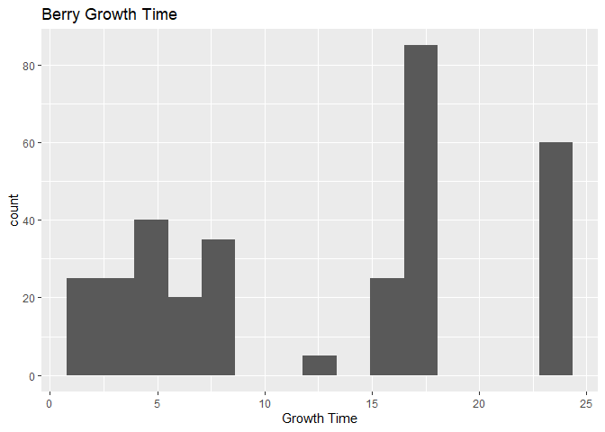

ST 558 - Project 2
================
Paula Bailey and Yi Ren
2022-09-22

Pokémon inhabit the world of the Pokémon games. The franchise was
created by Satoshi Tajiri in 1996. These fictional creatures can be
caught using Pokéballs and trained by battling with other Pokémon. There
are current 920 species according to Wikipedia.

This vignette will walk the reader through the process of connecting to
& collecting data from PokeAPI <https://pokeapi.co/> within R
programming environment.

## Reference to Render Code

``` r
rmarkdown::render("Project2.Rmd", "github_document","README.md")
```

## Packages for Vignette

The following packages are required for connecting and retrieving data
from the API.

1.  `httr` - *Retrieves Data from an API*
2.  `jsonlite` - *Parses Results from an API Query*
3.  `dplyr` - *A part of the `tidyverse` used for manipulating data*
4.  `tidyr` - *A part of the `tidyverse` used for data cleaning and
    ‘tidying’*
5.  `ggplot2` - *A part of the `tidyverse` used for creating graphics*

``` r
# Read in Required Packages 
library(httr)
library(jsonlite)
library(tidyverse)
library(ggplot2)
```

——TYPE \## Function for obtaining obtaining type The type (number) is
necessary to find any moe information

``` r
get_type <- function(type = fire){
  base<-"https://pokeapi.co/api/v2/type/"
  url<-(paste0(base,type,"/"))
  type_api<-GET(url) %>% content("text") %>% fromJSON(flatten=TRUE)
  
  type <-tibble(typeID = type_api[["id"]],
                move =type_api[["moves"]][[1]][[1]])
  return(type)
}
```

——MOVES

``` r
get_moves <- function(type=10){
  base<-"https://pokeapi.co/api/v2/move/"
  url<-(paste0(base,type,"/"))
  move_api<-GET(url) %>% content("text") %>% fromJSON(flatten=TRUE)
  #move_ailments_api<-lookup_moves("move-ailment", type) 
  #move_battleStyle_api<-lookup_moves("move-battle-style", type) 
  #move_categories_api<-lookup_moves("move-category", type) 
  #move_damageClass_api<-lookup_moves("move-damage-class",type) 
  #move_learnMethod_api<-lookup_moves("move-learn-method", type) 
  #move_target_api<-lookup_moves("move-target", type) 
  
  
moves <- tibble(
  idMove =move_api[["id"]],
  nameMove=move_api[["name"]],
  accuracy = move_api[["accuracy"]],
  power = move_api[["power"]],
  PowerPoint = move_api[["pp"]],
  #Ailments = move_ailments_api[["moves"]][[1]],
  #battle = move_battleStyle_api[["name"]],
  #target = move_target_api[["name"]]
)


  return(moves)

}
```

——BERRY

This next section will pull information about the pokemon berry from the
api. Berries are small fruits that can provide restoration, stat
enhancement, and even damage negation when eaten by Pokémon.
<https://bulbapedia.bulbagarden.net/wiki/Berry> information seems to be
the only information that is worth plotting.

Gets data for the first berry and puts it into a df

``` r
res = GET("https://pokeapi.co/api/v2/berry/1/") 
api_text<-content(res,"text")
api_json<-fromJSON(api_text,flatten=TRUE)
```

``` r
berries_df <- as.data.frame(api_json)
```

Gets data for the remaining berries and combines into first berry df.

``` r
for(i in 2:64){
  #increment through each berry until we get all 64 berries
  base <- "https://pokeapi.co/api/v2/berry/"
  call_next <- (paste0(base,i,"/"))
  
  res2 = GET(call_next) 
  api_text2<-content(res2,"text")
  api_json2<-fromJSON(api_text2,flatten=TRUE)
  
  next_df <- as.data.frame(api_json2)
  
  berries_df <- rbind(berries_df,next_df)
  

}
```

summarize

``` r
table(berries_df$flavors.flavor.name, berries_df$growth_time)
#>         
#>           2  3  4  5  6  8 12 15 18 24
#>   bitter  5  5  3  5  4  7  1  5 17 12
#>   dry     5  5  3  5  4  7  1  5 17 12
#>   sour    5  5  3  5  4  7  1  5 17 12
#>   spicy   5  5  3  5  4  7  1  5 17 12
#>   sweet   5  5  3  5  4  7  1  5 17 12
```

``` r
table(berries_df$flavors.flavor.name, berries_df$flavors.potency)
#>         
#>           0 10 15 20 25 30 40
#>   bitter 36 19  3  2  0  3  1
#>   dry    34 20  3  2  1  3  1
#>   sour   36 17  3  2  0  5  1
#>   spicy  35 17  3  2  1  5  1
#>   sweet  35 18  3  2  0  5  1
```

Numerical Summary - Growth Time

``` r
summary(berries_df$growth_time)
#>    Min. 1st Qu.  Median    Mean 3rd Qu.    Max. 
#>    2.00    5.00   15.00   12.86   18.00   24.00
```

Numerical Summary - Soil Dryness

``` r
summary(berries_df$soil_dryness)
#>    Min. 1st Qu.  Median    Mean 3rd Qu.    Max. 
#>     4.0     6.0     8.0    10.2    10.0    35.0
```

Correlation The is a strongly negative correlation between berry growth
time and soil dryness. As the berry grows, the soil becomes drier.

``` r
cor(berries_df$growth_time,berries_df$soil_dryness)
#> [1] -0.6768502
```

There is a positive correlation between natural gift power and the size
of berry. As the berry grows, the natural gift power increases. This
gift deals damage with no additional effects. However, the damage
depends on the type of berry consumed.

``` r
cor(berries_df$natural_gift_power, berries_df$size)
#> [1] 0.2717077
```

There does appear to be a positive relationship between the type of
berry and damage received from the berry

``` r
cor(berries_df$id, berries_df$natural_gift_power)
#> [1] 0.5214908
```

``` r
berries_df %>% group_by(berries_df$flavors.flavor.name)%>%
  summarise(avg = mean(berries_df$growth_time), med = median(berries_df$growth_time), var = var(berries_df$growth_time))
#> # A tibble: 5 x 4
#>   `berries_df$flavors.flavor.name`   avg   med   var
#>   <chr>                            <dbl> <dbl> <dbl>
#> 1 bitter                            12.9    15  61.7
#> 2 dry                               12.9    15  61.7
#> 3 sour                              12.9    15  61.7
#> 4 spicy                             12.9    15  61.7
#> 5 sweet                             12.9    15  61.7
```

``` r
berries_df %>% group_by(berries_df$soil_drynes)%>%
  summarise(avg = mean(berries_df$growth_time), med = median(berries_df$growth_time), var = var(berries_df$growth_time))
#> # A tibble: 7 x 4
#>   `berries_df$soil_drynes`   avg   med   var
#>                      <int> <dbl> <dbl> <dbl>
#> 1                        4  12.9    15  61.7
#> 2                        6  12.9    15  61.7
#> 3                        7  12.9    15  61.7
#> 4                        8  12.9    15  61.7
#> 5                       10  12.9    15  61.7
#> 6                       15  12.9    15  61.7
#> 7                       35  12.9    15  61.7
```

``` r
berrySummary <- berries_df %>% select(flavors.potency, growth_time, max_harvest, natural_gift_power, size, smoothness, soil_dryness) %>% apply(2, function(x){summary(x[!is.na(x)])}) 
knitr::kable(berrySummary, caption = 'Summary of Berry Stats', digits = 2)
```

|         | flavors.potency | growth_time | max_harvest | natural_gift_power |   size | smoothness | soil_dryness |
|:--------|----------------:|------------:|------------:|-------------------:|-------:|-----------:|-------------:|
| Min.    |            0.00 |        2.00 |        5.00 |              60.00 |  20.00 |      20.00 |          4.0 |
| 1st Qu. |            0.00 |        5.00 |        5.00 |              60.00 |  45.75 |      25.00 |          6.0 |
| Median  |            0.00 |       15.00 |        5.00 |              60.00 |  98.50 |      30.00 |          8.0 |
| Mean    |            6.92 |       12.86 |        6.48 |              67.19 | 120.53 |      31.56 |         10.2 |
| 3rd Qu. |           10.00 |       18.00 |        5.00 |              70.00 | 155.25 |      35.00 |         10.0 |
| Max.    |           40.00 |       24.00 |       15.00 |              80.00 | 300.00 |      60.00 |         35.0 |

Summary of Berry Stats

Categorical chart

``` r
g<-ggplot(berries_df,aes(x = firmness.name))
      g + 
        geom_bar(aes(fill = size),
                   position = "dodge") + 
        labs(x = "Firmness of Berry Fruit", y = "Count", title = "Firmness By Category") + 
        scale_fill_discrete(name = "Size Category") 
```

<!-- -->

``` r
    g<-ggplot(berries_df,
              aes(x = soil_dryness))
      g + geom_histogram(bins = 15) + 
        labs(x = "Soil",title = "Dryness of the Soil") 
```

<!-- -->

``` r
    g<-ggplot(berries_df,
              aes(x = growth_time))
      g + geom_histogram(bins = 15) + 
        labs(x = "Growth Time",title = "Berry Growth Time") 
```

<!-- -->

``` r
    g<-ggplot(berries_df,
              aes(x = growth_time, y = soil_dryness))
      g + geom_smooth(formula = y~x, method = "loess") + 
          geom_point() +
          labs(x = "Growth Time",title = "Berry Growth Time") 
```


