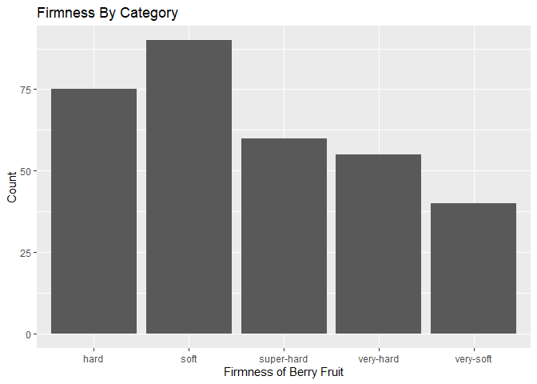
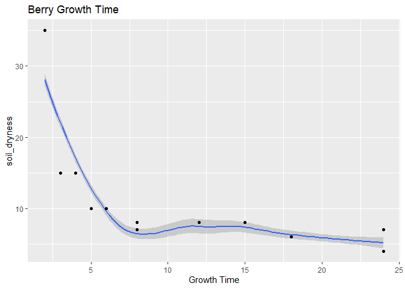

ST 558 - Project 2
================
Paula Bailey and Yi Ren
2022-09-22

Pokémon inhabit the world of the Pokémon games. The franchise was
created by Satoshi Tajiri in 1996. These fictional creatures can be
caught using Pokéballs and trained by battling with other Pokémon. There
are current 920 species according to Wikipedia.

This vignette will walk the reader through the process of connecting to
& collecting data from PokeAPI <https://pokeapi.co/> within R
programming environment.

## Reference to Render Code

``` r
rmarkdown::render("Project2.Rmd", "github_document","README.md")
```

## Packages for Vignette

The following packages are required for connecting and retrieving data
from the API.

1.  `httr` - *Retrieves Data from an API*
2.  `jsonlite` - *Parses Results from an API Query*
3.  `dplyr` - *A part of the `tidyverse` used for manipulating data*
4.  `tidyr` - *A part of the `tidyverse` used for data cleaning and
    ‘tidying’*
5.  `ggplot2` - *A part of the `tidyverse` used for creating graphics*

``` r
# Read in Required Packages 
library(httr)
library(jsonlite)
library(tidyverse)
library(ggplot2)
```

The pokemon api allow the user to pull information via the pokemon’s
name or ID number.

Descriptions Moves:

id The identifier for this resource. * name The name for this
resource. * accuracy The percent value of how likely this move is to be
successful. * effect_chance The percent value of how likely it is this
moves effect will happen* pp Power points. The number of times this move
can be used. contest_combos A detail of normal and super contest combos
that require this move. contest_effect The effect the move has when used
in a contest. damage_class The type of damage the move inflicts on the
target, e.g. physical. learned_by_pokemon List of Pokemon that can learn
the move stat_changes A list of stats this moves effects and how much it
effects them. target The type of target that will receive the effects of
the attack.

``` r
# Create a function for pokemon moves
lookup_moves<-function(infoMove, value){
  base<-"https://pokeapi.co/api/v2/"
  url<-(paste0(base,infoMove,"/",value,"/"))
  pokemon_api<-GET(url) %>% content("text") %>% fromJSON(flatten=TRUE)
  return(pokemon_api)
}
```

## Function for obtaining information on moves —orginal

``` r
get_moves <- function(move = "move", 
                      move_info = 1, 
                      ailment=1,              #max 21
                      battlestyle=1,          #max 3
                      category=1,             #max 13
                      damage=1,               #max 3
                      target=1,               #max 15
                      learn=1){               #max11

  move_api<-lookup_moves("move", move_info)
  move_ailments_api<-lookup_moves("move-ailment", ailment) 
  move_battleStyle_api<-lookup_moves("move-battle-style", battlestyle) 
  move_categories_api<-lookup_moves("move-category", category) 
  move_damageClass_api<-lookup_moves("move-damage-class",damage) 
  move_learnMethod_api<-lookup_moves("move-learn-method", learn) 
  move_target_api<-lookup_moves("move-target", target) 
  
  
moves <<- tibble(
  id =move_api[["id"]],
  name=move_api[["name"]],
  accuracy =move_api[["accuracy"]],
  power =move_api[["power"]],
  PowerPoint =move_api[["pp"]],
  move_ailments_api[["moves"]][[1]],
  move_battleStyle_api[["name"]],
  move_target_api[["name"]],
)

damage <<- tibble(
   move_damageClass_api[["name"]],
   move_damageClass_api[["moves"]][["name"]], 
)
  
category <<- tibble(
  move_categories_api[["name"]],
  move_categories_api[["moves"]][["name"]]
)


learn <<- tibble(
   move_learnMethod_api[["name"]],
   move_learnMethod_api[["version_groups"]][["name"]],
)

  return(list(moves, damage, category, learn))

}
```

``` r
get_moves("move",     move_info = 826, 
                      ailment=1,
                      battlestyle=1,
                      category=1,
                      damage=1,
                      target=1,
                      learn=1)
#> [[1]]
#> # A tibble: 23 x 8
#>       id name        accuracy power PowerPoint `move_ailments_api[["moves"]][[1]]` move_battleStyle~1 move_~2
#>    <int> <chr>          <int> <int>      <int> <chr>                               <chr>              <chr>  
#>  1   826 eerie-spell      100    80          5 thunder-punch                       attack             specif~
#>  2   826 eerie-spell      100    80          5 body-slam                           attack             specif~
#>  3   826 eerie-spell      100    80          5 stun-spore                          attack             specif~
#>  4   826 eerie-spell      100    80          5 thunder-shock                       attack             specif~
#>  5   826 eerie-spell      100    80          5 thunderbolt                         attack             specif~
#>  6   826 eerie-spell      100    80          5 thunder-wave                        attack             specif~
#>  7   826 eerie-spell      100    80          5 thunder                             attack             specif~
#>  8   826 eerie-spell      100    80          5 lick                                attack             specif~
#>  9   826 eerie-spell      100    80          5 glare                               attack             specif~
#> 10   826 eerie-spell      100    80          5 zap-cannon                          attack             specif~
#> # ... with 13 more rows, and abbreviated variable names 1: `move_battleStyle_api[["name"]]`,
#> #   2: `move_target_api[["name"]]`
#> 
#> [[2]]
#> [1] 1
#> 
#> [[3]]
#> [1] 1
#> 
#> [[4]]
#> [1] 1
```

``` r
#reading encounter data
encounter_api = GET("https://pokeapi.co/api/v2/pokemon/ditto/encounters") 
encounter_text<-content(encounter_api,"text")
encounter_json<-fromJSON(encounter_text,flatten=TRUE)
```

``` r
#where you can encounter this pokeman
encounter_json$location_area.name
#>  [1] "sinnoh-route-218-area"          "johto-route-34-area"            "johto-route-35-area"           
#>  [4] "johto-route-47-area"            "kanto-route-13-area"            "kanto-route-14-area"           
#>  [7] "kanto-route-15-area"            "cerulean-cave-1f"               "cerulean-cave-2f"              
#> [10] "cerulean-cave-b1f"              "kanto-route-23-area"            "pokemon-mansion-b1f"           
#> [13] "desert-underpass-area"          "giant-chasm-forest"             "giant-chasm-forest-cave"       
#> [16] "pokemon-village-area"           "johto-safari-zone-zone-wetland"
```

using above to create function: get_encounter \<- function()

``` r
#reading forms data
forms_api = GET("https://pokeapi.co/api/v2/pokemon-form/ditto/") 
api_forms<-content(forms_api,"text")
api_json2<-fromJSON(api_forms,flatten=TRUE)
```

``` r
#reading types data
types_api<-GET(api_json2[["types"]][["type.url"]][[1]])
types_text<-content(types_api,"text")
df_types<-fromJSON(types_text,flatten=TRUE)
```

This next section will pull information about the pokemon berry from the
api. Berries are small fruits that can provide restoration, stat
enhancement, and even damage negation when eaten by Pokémon.
<https://bulbapedia.bulbagarden.net/wiki/Berry> information seems to be
the only information that is worth plotting.

Gets data for the first berry and puts it into a df

``` r
res = GET("https://pokeapi.co/api/v2/berry/1/") 
api_text<-content(res,"text")
api_json<-fromJSON(api_text,flatten=TRUE)
```

``` r
berries_df <- as.data.frame(api_json)
```

Gets data for the remaining berries and combines into first berry df.

``` r
for(i in 2:64){
  #increment through each berry until we get all 64 berries
  base <- "https://pokeapi.co/api/v2/berry/"
  call_next <- (paste0(base,i,"/"))
  
  res2 = GET(call_next) 
  api_text2<-content(res2,"text")
  api_json2<-fromJSON(api_text2,flatten=TRUE)
  
  next_df <- as.data.frame(api_json2)
  
  berries_df <- rbind(berries_df,next_df)
  

}
```

Descriptions from `pokeapi.co` website: name: name of berry.

growth_time:  
Time it takes the tree to grow one stage, in hours. Berry trees go
through four of these growth stages before they can be picked.

size: The size of this Berry, in millimeters.

soil_dryness: The speed at which this Berry dries out the soil as it
grows. A higher rate means the soil dries more quickly.

firmness: The firmness of this berry, used in making Pokéblocks or
Poffins.

flavors: A list of references to each flavor a berry can have and the
potency of each of those flavors in regard to this berry.

Gets data for the encounter condition value and puts it into a df

``` r
res = GET("https://pokeapi.co/api/v2/encounter-condition-value/1") 
api_text<-content(res,"text")
api_json<-fromJSON(api_text,flatten=TRUE)
```

``` r
encounter_values_df <- as.data.frame(api_json)
```

``` r
for(i in 2:31){
  #increment through each encounter method until we get all 31 methods
  base <- "https://pokeapi.co/api/v2/encounter-condition-value/"
  call_next <- (paste0(base,i,"/"))
  
  res2 = GET(call_next) 
  api_text2<-content(res2,"text")
  api_json2<-fromJSON(api_text2,flatten=TRUE)
  
  next_df <- as.data.frame(api_json2)
  
  encounter_values_df <- rbind(encounter_values_df,next_df)
  
}
```

------------------------------------------------------------------------

Gets data for the encounter methods and puts it into a df

``` r
res = GET("https://pokeapi.co/api/v2/encounter-method/1") 
api_text<-content(res,"text")
api_json<-fromJSON(api_text,flatten=TRUE)
```

``` r
encounter_method_df <- as.data.frame(api_json)
```

Gets data for the remaining encounter methods and combines into df.
`Need to work on a method to loop through api without for loop and hard coding the end point.`

``` r
for(i in 2:31){
  #increment through each encounter method until we get all 31 methods
  base <- "https://pokeapi.co/api/v2/encounter-method/"
  call_next <- (paste0(base,i,"/"))
  
  res2 = GET(call_next) 
  api_text2<-content(res2,"text")
  api_json2<-fromJSON(api_text2,flatten=TRUE)
  
  next_df <- as.data.frame(api_json2)
  
  encounter_method_df <- rbind(encounter_method_df,next_df)
  
}
```

NEXT STEP - LOOKS LIKE WE CAN JOIN ENCOUNTERS BY ID AND THEN LANGUAGE
ALSO REVISIT ENCOUNTER CONDITIONS….REC’D AN ERROR

``` r
combineEncounter <- inner_join(encounter_method_df, 
           encounter_values_df, 
           by = c("id" = "id")) %>% filter(names.language.name.x == "en" & names.language.name.y == "en")
           
```

summarize

``` r
table(berries_df$flavors.flavor.name, berries_df$growth_time)
#>         
#>           2  3  4  5  6  8 12 15 18 24
#>   bitter  5  5  3  5  4  7  1  5 17 12
#>   dry     5  5  3  5  4  7  1  5 17 12
#>   sour    5  5  3  5  4  7  1  5 17 12
#>   spicy   5  5  3  5  4  7  1  5 17 12
#>   sweet   5  5  3  5  4  7  1  5 17 12
```

``` r
table(berries_df$flavors.flavor.name, berries_df$flavors.potency)
#>         
#>           0 10 15 20 25 30 40
#>   bitter 36 19  3  2  0  3  1
#>   dry    34 20  3  2  1  3  1
#>   sour   36 17  3  2  0  5  1
#>   spicy  35 17  3  2  1  5  1
#>   sweet  35 18  3  2  0  5  1
```

Numerical Summary - Growth Time

``` r
summary(berries_df$growth_time)
#>    Min. 1st Qu.  Median    Mean 3rd Qu.    Max. 
#>    2.00    5.00   15.00   12.86   18.00   24.00
```

Numerical Summary - Soil Dryness

``` r
summary(berries_df$soil_dryness)
#>    Min. 1st Qu.  Median    Mean 3rd Qu.    Max. 
#>     4.0     6.0     8.0    10.2    10.0    35.0
```

Correlation

``` r
cor(berries_df$growth_time,berries_df$soil_dryness)
#> [1] -0.6768502
```

``` r
cor(berries_df$growth_time, berries_df$size)
#> [1] 0.1178562
```

``` r
berries_df %>% group_by(berries_df$flavors.flavor.name)%>%
  summarise(avg = mean(berries_df$growth_time), med = median(berries_df$growth_time), var = var(berries_df$growth_time))
#> # A tibble: 5 x 4
#>   `berries_df$flavors.flavor.name`   avg   med   var
#>   <chr>                            <dbl> <dbl> <dbl>
#> 1 bitter                            12.9    15  61.7
#> 2 dry                               12.9    15  61.7
#> 3 sour                              12.9    15  61.7
#> 4 spicy                             12.9    15  61.7
#> 5 sweet                             12.9    15  61.7
```

``` r
berries_df %>% group_by(berries_df$soil_drynes)%>%
  summarise(avg = mean(berries_df$growth_time), med = median(berries_df$growth_time), var = var(berries_df$growth_time))
#> # A tibble: 7 x 4
#>   `berries_df$soil_drynes`   avg   med   var
#>                      <int> <dbl> <dbl> <dbl>
#> 1                        4  12.9    15  61.7
#> 2                        6  12.9    15  61.7
#> 3                        7  12.9    15  61.7
#> 4                        8  12.9    15  61.7
#> 5                       10  12.9    15  61.7
#> 6                       15  12.9    15  61.7
#> 7                       35  12.9    15  61.7
```

``` r
berrySummary <- berries_df %>% select(flavors.potency, growth_time, max_harvest, natural_gift_power, size, smoothness, soil_dryness) %>% apply(2, function(x){summary(x[!is.na(x)])}) 
knitr::kable(berrySummary, caption = 'Summary of Berry Stats', digits = 2)
```

|         | flavors.potency | growth_time | max_harvest | natural_gift_power |   size | smoothness | soil_dryness |
|:--------|----------------:|------------:|------------:|-------------------:|-------:|-----------:|-------------:|
| Min.    |            0.00 |        2.00 |        5.00 |              60.00 |  20.00 |      20.00 |          4.0 |
| 1st Qu. |            0.00 |        5.00 |        5.00 |              60.00 |  45.75 |      25.00 |          6.0 |
| Median  |            0.00 |       15.00 |        5.00 |              60.00 |  98.50 |      30.00 |          8.0 |
| Mean    |            6.92 |       12.86 |        6.48 |              67.19 | 120.53 |      31.56 |         10.2 |
| 3rd Qu. |           10.00 |       18.00 |        5.00 |              70.00 | 155.25 |      35.00 |         10.0 |
| Max.    |           40.00 |       24.00 |       15.00 |              80.00 | 300.00 |      60.00 |         35.0 |

Summary of Berry Stats

Categorical chart

``` r
g<-ggplot(berries_df,aes(x = firmness.name))
      g + 
        geom_bar(aes(fill = size),
                   position = "dodge") + 
        labs(x = "Firmness of Berry Fruit", y = "Count", title = "Firmness By Category") + 
        scale_fill_discrete(name = "Size Category") 
```

<!-- -->

``` r
    g<-ggplot(berries_df,
              aes(x = soil_dryness))
      g + geom_histogram(bins = 15) + 
        labs(x = "Soil",title = "Dryness of the Soil") 
```

<!-- -->

``` r
    g<-ggplot(berries_df,
              aes(x = growth_time))
      g + geom_histogram(bins = 15) + 
        labs(x = "Growth Time",title = "Berry Growth Time") 
```

<!-- -->

``` r
    g<-ggplot(berries_df,
              aes(x = growth_time, y = soil_dryness))
      g + geom_smooth(formula = y~x, method = "loess") + 
          geom_point() +
          labs(x = "Growth Time",title = "Berry Growth Time") 
```


