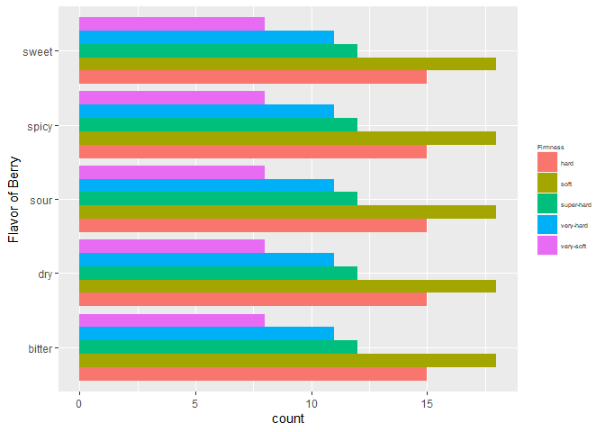
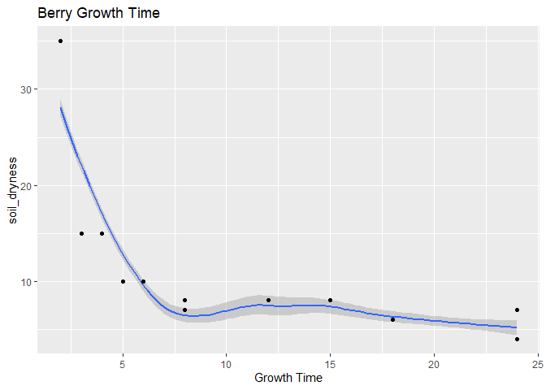

ST 558 - Project 2
================
Paula Bailey and Yi Ren
2022-09-22

Pokémon inhabit the world of the Pokémon games. The franchise was
created by Satoshi Tajiri in 1996. These fictional creatures can be
caught using Pokéballs and trained by battling with other Pokémon. There
are current 920 species according to Wikipedia.

This vignette will walk the reader through the process of connecting to
& collecting data from PokeAPI <https://pokeapi.co/> within R
programming environment.

## Reference to Render Code

``` r
rmarkdown::render("Project2.Rmd", "github_document","README.md")
```

## Packages for Vignette

The following packages are required for connecting and retrieving data
from the API.

1.  `httr` - *Retrieves Data from an API*
2.  `jsonlite` - *Parses Results from an API Query*
3.  `dplyr` - *A part of the `tidyverse` used for manipulating data*
4.  `tidyr` - *A part of the `tidyverse` used for data cleaning and
    ‘tidying’*
5.  `ggplot2` - *A part of the `tidyverse` used for creating graphics*

``` r
# Read in Required Packages 
library(httr)
library(jsonlite)
library(tidyverse)
library(ggplot2)
```

——TYPE \## Function for obtaining obtaining type The type (number) is
necessary to find any moe information

``` r
get_type <- function(type = fire){
  base<-"https://pokeapi.co/api/v2/type/"
  url<-(paste0(base,type,"/"))
  type_api<-GET(url) %>% content("text") %>% fromJSON(flatten=TRUE)
  
  type <-tibble(typeID = type_api[["id"]],
                move =type_api[["moves"]][[1]][[1]])
  return(type)
}
```

——MOVES

``` r
get_moves <- function(type=10){
  base<-"https://pokeapi.co/api/v2/move/"
  url<-(paste0(base,type,"/"))
  move_api<-GET(url) %>% content("text") %>% fromJSON(flatten=TRUE)
  #move_ailments_api<-lookup_moves("move-ailment", type) 
  #move_battleStyle_api<-lookup_moves("move-battle-style", type) 
  #move_categories_api<-lookup_moves("move-category", type) 
  #move_damageClass_api<-lookup_moves("move-damage-class",type) 
  #move_learnMethod_api<-lookup_moves("move-learn-method", type) 
  #move_target_api<-lookup_moves("move-target", type) 
  
  
moves <- tibble(
  idMove =move_api[["id"]],
  nameMove=move_api[["name"]],
  accuracy = move_api[["accuracy"]],
  power = move_api[["power"]],
  PowerPoint = move_api[["pp"]],
  #Ailments = move_ailments_api[["moves"]][[1]],
  #battle = move_battleStyle_api[["name"]],
  #target = move_target_api[["name"]]
)


  return(moves)

}
```

——BERRY

This next section will pull information about the pokemon berry from the
api. Berries are small fruits that can provide restoration, stat
enhancement, and even damage negation when eaten by Pokémon.
<https://bulbapedia.bulbagarden.net/wiki/Berry> information seems to be
the only information that is worth plotting.

Gets data for the first berry and puts it into a df

``` r
res = GET("https://pokeapi.co/api/v2/berry/1/") 
api_text<-content(res,"text")
api_json<-fromJSON(api_text,flatten=TRUE)
```

``` r
berries_df <- as.data.frame(api_json)
```

Gets data for the remaining berries and combines into first berry df.

``` r
for(i in 2:64){
  #increment through each berry until we get all 64 berries
  base <- "https://pokeapi.co/api/v2/berry/"
  call_next <- (paste0(base,i,"/"))
  
  res2 = GET(call_next) 
  api_text2<-content(res2,"text")
  api_json2<-fromJSON(api_text2,flatten=TRUE)
  
  next_df <- as.data.frame(api_json2)
  
  berries_df <- rbind(berries_df,next_df)
  

}
```

## Get Pokemon

To request information from the api, the user has 3 options:

1.  Get Basic information and Training
2.  Get Basic information and Stats
3.  Get All - Basic information, Training, and Stats
4.  Get Berry information.

The default arguments are (pokemon = 132, tran = 1, stat = 1, move = 1,
berry=0), where 1 is return this information and 0 do not return this
information. \#change EVAL later

``` r
get_pokemon("DITTO")
```

## 7. Function to get your pokemon

``` r
get_pokemon <- function(pokemon = 132, tran =1, stat = 1, move = 1, berry=0){
    poke_One<-NULL
    
  if (is.numeric(pokemon) == "TRUE"){
    pokemon_mini<-lookname(lookid(pokemon))
  } else {
    pokemon_mini<-lookname(pokemon)
  }

  poke_One<-NULL  
  if(move == 0 & tran == 1 & stat == 0){
    basic <-basic(pokemon_mini)          #provides training and base
    traning<-traning(pokemon_mini)
    poke_One<-merge(basic,traning)
  }else if(move == 0 & tran == 0 & stat == 1){
    basic <-basic(pokemon_mini)         
    stat<-stats(pokemon_mini)            ##provides stats and base
    poke_One<-merge(basic,stat)
  }else if(move == 1 & tran == 1 & stat == 1){
    poke_One[1]<-lapply(pokemon, FUN=info)   #provides all info including moves
  }else{
    poke_One[1]<-lapply(pokemon, FUN=info)   #if a combination is missed, return everything
  }
   
  if(berry == 1){
    berry <- get_berry()
  }

return(list(poke_One, berry))
}
```

summarize

``` r
table(berries_df$flavors.flavor.name, berries_df$growth_time)
```

    ##         
    ##           2  3  4  5  6  8 12 15 18 24
    ##   bitter  5  5  3  5  4  7  1  5 17 12
    ##   dry     5  5  3  5  4  7  1  5 17 12
    ##   sour    5  5  3  5  4  7  1  5 17 12
    ##   spicy   5  5  3  5  4  7  1  5 17 12
    ##   sweet   5  5  3  5  4  7  1  5 17 12

``` r
table(berries_df$flavors.flavor.name, berries_df$flavors.potency)
```

    ##         
    ##           0 10 15 20 25 30 40
    ##   bitter 36 19  3  2  0  3  1
    ##   dry    34 20  3  2  1  3  1
    ##   sour   36 17  3  2  0  5  1
    ##   spicy  35 17  3  2  1  5  1
    ##   sweet  35 18  3  2  0  5  1

Numerical Summary - Growth Time

``` r
summary(berries_df$growth_time)
```

    ##    Min. 1st Qu.  Median    Mean 3rd Qu.    Max. 
    ##    2.00    5.00   15.00   12.86   18.00   24.00

Numerical Summary - Soil Dryness

``` r
summary(berries_df$soil_dryness)
```

    ##    Min. 1st Qu.  Median    Mean 3rd Qu.    Max. 
    ##     4.0     6.0     8.0    10.2    10.0    35.0

Correlation The is a strongly negative correlation between berry growth
time and soil dryness. As the berry grows, the soil becomes drier.

``` r
cor(berries_df$growth_time,berries_df$soil_dryness)
```

    ## [1] -0.6768502

There is a positive correlation between natural gift power and the size
of berry. As the berry grows, the natural gift power increases. This
gift deals damage with no additional effects. However, the damage
depends on the type of berry consumed.

``` r
cor(berries_df$natural_gift_power, berries_df$size)
```

    ## [1] 0.2717077

There does appear to be a positive relationship between the type of
berry and damage received from the berry

``` r
cor(berries_df$id, berries_df$natural_gift_power)
```

    ## [1] 0.5214908

``` r
berrySummary <- berries_df %>% select(flavors.potency, growth_time, max_harvest, natural_gift_power, size, smoothness, soil_dryness) %>% apply(2, function(x){summary(x[!is.na(x)])}) 
knitr::kable(berrySummary, caption = 'Summary of Berry Stats', digits = 2)
```

|         | flavors.potency | growth_time | max_harvest | natural_gift_power |   size | smoothness | soil_dryness |
|:--------|----------------:|------------:|------------:|-------------------:|-------:|-----------:|-------------:|
| Min.    |            0.00 |        2.00 |        5.00 |              60.00 |  20.00 |      20.00 |          4.0 |
| 1st Qu. |            0.00 |        5.00 |        5.00 |              60.00 |  45.75 |      25.00 |          6.0 |
| Median  |            0.00 |       15.00 |        5.00 |              60.00 |  98.50 |      30.00 |          8.0 |
| Mean    |            6.92 |       12.86 |        6.48 |              67.19 | 120.53 |      31.56 |         10.2 |
| 3rd Qu. |           10.00 |       18.00 |        5.00 |              70.00 | 155.25 |      35.00 |         10.0 |
| Max.    |           40.00 |       24.00 |       15.00 |              80.00 | 300.00 |      60.00 |         35.0 |

Summary of Berry Stats

Categorical chart

# Bar Plot

This bar plot show the categories of flavor for berry which are grouped
by their firmness. The soft berries comprise a larger number of the
berries. It does not matter what the flavor of the berry is.

``` r
ggplot(berries_df,aes(y = flavors.flavor.name, fill = firmness.name)) + geom_bar(position="dodge") + labs(y="Flavor of Berry") + scale_fill_discrete(name="Firmness") + theme(legend.title = element_text(size = 5), legend.text = element_text(size = 5))
```



# Histogram

This histogram shows the distribution of growing time for berries. It
show a bimodal distribution.

``` r
    g<-ggplot(berries_df,
              aes(x = growth_time))
    g + geom_histogram(bins = 5) + 
        labs(x = "Growth Time",title = "Histogram of Berry Growth Time")  + 
        theme(legend.title =    element_text(size = 5), legend.text = element_text(size = 5))
```


# Scatter plot

The scatter plot visually verifies the negative relationship between the
growth of berries and soil dryness. As the berry grows, the soil becomes
drier.

``` r
    g<-ggplot(berries_df,
              aes(x = growth_time, y = soil_dryness))
      g + geom_smooth(formula = y~x, method = "loess") + 
          geom_point() +
          labs(x = "Growth Time",title = "Berry Growth Time") 
```



We want to see if having a higher BMI (weight/height) results in a
slower speed. We can see a couple of pokemons with a higher BMI which
have a slower speed. In general, there does not appear to be
relationship. ADD ME\*\*

``` r
    g<-ggplot(poke,
              aes(x = round((weight/height),2), y = speed))
      g + geom_point(aes(color = type)) +
          labs(x = "BMI", y= "Speed",title = "Body Mass Index (BMI) and Speed") +
         theme(legend.title = element_text(size = 5), legend.text = element_text(size = 5))
```
